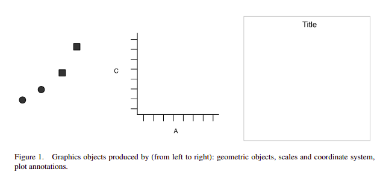

```{r setup, include=FALSE}
knitr::opts_chunk$set(echo = TRUE)
suppressPackageStartupMessages(library(ggplot2))
# suppressPackageStartupMessages(library(tidyverse))
```

# Introduction

-   R for Data Science ("R4DS") written by Hadley Wickham who led the development of the `tidyverse`: a series of interconnected R packages.

    Key packages include:

    -   `ggplot2` for making graphs
    -   `dplyr` for transforming data
    -   `tidyr` for reshaping (i.e. pivoting or "tidying" data)

# Exploration section

R's basic plotting system is pretty clunky (as is like the basic plotting systems in many programming languages... looking at you, `matplotlib`):

```{r}
plot(diamonds$carat, diamonds$price)
```

The `ggplot2` library is based on the idea that all data visualizations can be described using a common language, the "grammar of graphics". For example:



Further reading on the Grammar of Graphics:

-   [Wickham (2010) A Layered Grammar of Graphics. Journal of Computational and Graphical Statistics, Volume 19, Number 1, Pages 3--28](http://vita.had.co.nz/papers/layered-grammar.pdf)

In code:

```{r}
ggplot(data = diamonds) +
  geom_point(mapping = aes(x = carat, y = price))
```

Key components of the grammar:

1.  Coordinate system. Default is created by the `ggplot()` function.

```{r}
ggplot()
```

2.  Layers
    -   We pick a type of "geometric object" for the layer and then map our data to some aesthetic appearance (e.g. color or position) of those objects.

```{r}
ggplot(data = diamonds) +
  geom_point(mapping = aes(x = carat, y = price))
```

    -   Using a different geometric object for our layer:

```{r}
ggplot(data = diamonds) +
  geom_histogram(mapping = aes(x = price))
```

    -   We can also customize the statistical transformation used to convert our data into the geometry, and the position. For example, using a different statistical transformation for our layer:

```{r}
ggplot(data = diamonds) +
  geom_histogram(mapping = aes(x = price, y=..density..))
```

    - We can easily add multiple layers to the same plot:

```{r}
ggplot(data = diamonds) +
  geom_point(mapping = aes(x = carat, y = price)) +
  geom_smooth(mapping = aes(x = carat, y = price), method = "lm")
```

3.  Scales

```{r}
ggplot(data = diamonds) +
  geom_point(mapping = aes(x = carat, y = price)) +
  geom_smooth(mapping = aes(x = carat, y = price), method = "lm") +
  ylim(0, 20000)
```

4.  Faceting

```{r}
ggplot(data = diamonds) +
  geom_point(mapping = aes(x = carat, y = price)) +
  geom_smooth(mapping = aes(x = carat, y = price), method = "lm") +
  ylim(0, 20000) +
  facet_wrap(
    ~ color
  )
```

Other tips:

-   Use the Help tab in the bottom right pane of RStudio to search for a dataset or function's documentation. Or type `?diamonds` or `?geom_point` (for example) in the *Console* to bring up the same documentation.

-   Official `ggplot2` cheatheet: <https://raw.githubusercontent.com/rstudio/cheatsheets/main/data-visualization.pdf>

## Exercises

1.  Take our scatter plot code from above:

``` r
ggplot(data = diamonds) +
  geom_point(mapping = aes(x = carat, y = price))
```

and make two new graphs. In the first one, add `color = clarity` as an argument of the `aes()` function. In the second, add `color = "red"` as an argument to the `geom_point()` function.

2.  `clarity` is a categorical variable. Modify your code from the previous exercise to color the scatter plot by a continuous variable instead, e.g. `carat`. How does the color scale change?

3.  Modify the histogram code from above:

``` r
ggplot(data = diamonds) +
  geom_histogram(mapping = aes(x = price))
```

to create two new graphs: (1) a boxplot using the `geom_boxplot()` function (you should not need to change any of the function's arguments), and (2) a violin plot using the `geom_violin()` function (you may need to change some of the function's arguments...).

4.  Log transform the `price` variable in your histogram from the previous exercise by adding this function to the end of your graph code: `... + scale_x_continuous(trans='log2')`.
